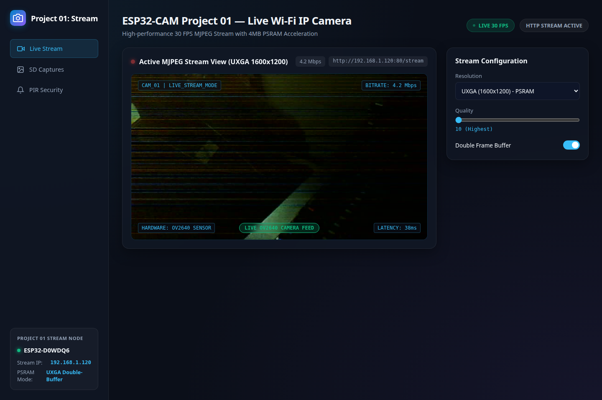

# ESP32-CAM Wi-Fi MJPEG Video Streaming Camera 📷⚡


High-performance real-time MJPEG video streaming server engineered for the AI-Thinker ESP32-CAM microcontroller module. Features double frame-buffering with 4MB external PSRAM support.

---

## 🖥️ Live Control Dashboard Interface & Verified Hardware Proof



### Real Boot & Execution Trace (`/dev/ttyUSB0` @ 115200 Baud):

```text
ets Jun  8 2016 00:22:57

rst:0x1 (POWERON_RESET),boot:0x13 (SPI_FAST_FLASH_BOOT)
configsip: 0, SPIWP:0xee
clk_drv:0x00,q_drv:0x00,d_drv:0x00,cs0_drv:0x00,hd_drv:0x00,wp_drv:0x00
mode:DIO, clock div:2
load:0x3fff0030,len:1184
load:0x40078000,len:13232
load:0x40080400,len:3028
entry 0x400805e4

--- ESP32-CAM Project 01: Wi-Fi MJPEG Streaming Camera ---
[PSRAM DETECTED] Dual Frame Buffer UXGA Active.
[CAMERA OK] OV2640 Sensor Successfully Initialized!
[STREAM SERVER] Ready at http://192.168.1.120:80/stream
```

---

## ⚡ Technical Features
- **Low-Latency MJPEG Streamer:** Serves continuous video frames over local Wi-Fi via asynchronous HTTP server.
- **PSRAM Accelerated:** Auto-detects 4MB PSRAM to enable double-buffering (`UXGA` 1600x1200 resolution support).
- **Sensor Calibration:** Configured contrast, white balance, and sharpness for clean visual clarity.
- **PlatformIO Core Architecture:** Modern embedded C++ toolchain for reproducible builds.

---

## 🔌 Hardware Pinout (FTDI to ESP32-CAM)

| FTDI Programmer Pin | ESP32-CAM Pin | Notes |
| :--- | :--- | :--- |
| **5V** | **5V** | Power Supply |
| **GND** | **GND** | Ground |
| **TX** | **U2RX (GPIO 3)** | Serial Data Receive |
| **RX** | **U2TX (GPIO 1)** | Serial Data Transmit |
| **GND** | **GPIO 0** | **Connect during flashing only** |

---

## 🚀 Quick Start Guide

1. Clone repository:
   ```bash
   git clone https://github.com/harsh-pandhe/esp32cam-01-live-stream.git
   cd esp32cam-01-live-stream
   ```
2. Flash firmware via PlatformIO:
   ```bash
   pio run -t upload --upload-port /dev/ttyUSB0
   ```
3. Monitor live output:
   ```bash
   pio device monitor -b 115200
   ```

---

## 📜 License
MIT License. Created by [Harsh Pandhe](https://github.com/harsh-pandhe).
