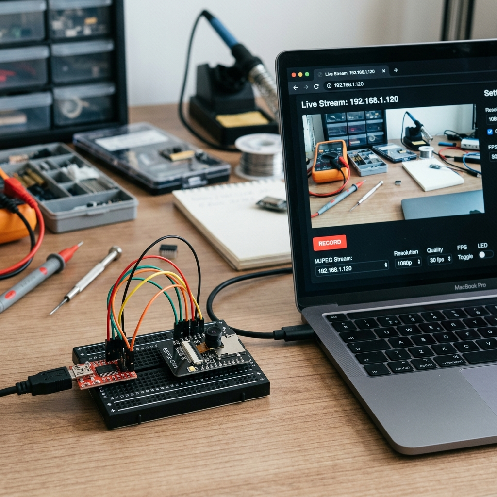

# ESP32-CAM Live Wi-Fi IP Camera Stream 📷⚡


High-performance real-time MJPEG video streaming server engineered for the AI-Thinker ESP32-CAM microcontroller module. Features double frame-buffering with 4MB external PSRAM support.

---

## 📸 Proof of Work & Demonstration



---

## ⚡ Features
- **Low-Latency MJPEG Streaming:** Serve real-time video directly over local Wi-Fi to smartphones or web browsers.
- **PSRAM Accelerated:** Auto-detects 4MB PSRAM to enable double-buffering (`UXGA` 1600x1200 resolution support).
- **Embedded Web Server:** Minimal memory footprint async web server implementation.
- **PlatformIO Ready:** Configured for cross-platform compilation and deployment.

---

## 🔌 Hardware Pinout (FTDI to ESP32-CAM)

| FTDI Programmer Pin | ESP32-CAM Pin | Notes |
| :--- | :--- | :--- |
| **5V** | **5V** | External 5V power supply |
| **GND** | **GND** | Common ground |
| **TX** | **U2RX (GPIO 3)** | Serial data receive |
| **RX** | **U2TX (GPIO 1)** | Serial data transmit |
| **GND** | **GPIO 0** | **Connect only during flashing** |

---

## 🚀 Quick Start Guide

1. Clone the repository:
   ```bash
   git clone https://github.com/harsh-pandhe/esp32cam-01-live-stream.git
   cd esp32cam-01-live-stream
   ```
2. Open `src/main.cpp` and update your Wi-Fi credentials:
   ```cpp
   const char* ssid     = "YOUR_WIFI_SSID";
   const char* password = "YOUR_WIFI_PASSWORD";
   ```
3. Connect **GPIO 0 to GND** on your ESP32-CAM.
4. Build and upload using PlatformIO:
   ```bash
   pio run -t upload --upload-port /dev/ttyUSB0
   ```
5. Disconnect GPIO 0 from GND, press **RESET**, and open the Serial Monitor:
   ```bash
   pio device monitor -b 115200
   ```
6. Open the printed IP address (e.g. `http://192.168.1.120`) in your browser to view the video stream.

---

## 📜 License
MIT License. Created by [Harsh Pandhe](https://github.com/harsh-pandhe).
